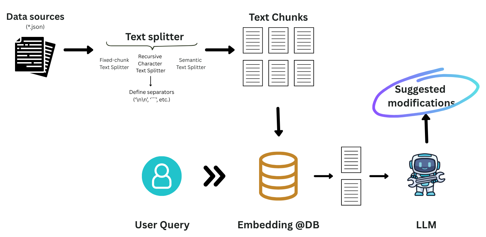

# Documentation Maintainer Backend

## Overview

This is the backend for **Documentation Maintainer**, a system that leverages AI to suggest, review, and manage documentation changes. The backend is built with **FastAPI** and orchestrates a Retrieval-Augmented Generation (RAG) workflow using **LangChain**, **ChromaDB**, and **Pydantic** for robust, scalable, and type-safe document processing.

---

## Features

- **Natural Language Querying**: Accepts user queries to find relevant documentation sections.
- **RAG Pipeline**: Uses LangChain and ChromaDB to retrieve and rank relevant documents.
- **AI-Powered Suggestions**: Generates suggested changes to documentation using LLMs.
- **Structured Responses**: All data models are defined with Pydantic for type safety and validation.
- **CORS Enabled**: Ready for integration with modern frontends (e.g., Next.js).

---

## Architecture


---

## Tech Stack

- **Python 3.12+**
- **FastAPI**: High-performance API framework
- **LangChain**: LLM orchestration and RAG pipeline
- **ChromaDB**: Vector database for document retrieval
- **Pydantic**: Data validation and serialization
- **Uvicorn**: ASGI server for local development

---

## Setup & Installation

1. **Install [uv](https://github.com/astral-sh/uv) (recommended)**
   ```bash
   curl -LsSf https://astral.sh/uv/install.sh | sh
   ```

2. **Install dependencies**
   ```bash
   uv sync
   ```

3. **Set up environment variables**
   - Copy `.env.example` to `.env` in `fastapi_backend/`
   - Fill in required API keys and settings

4. **Run the backend**
   ```bash
   cd fastapi_backend
   uvicorn routes:app --reload
   ```
   - Access the API docs at: [http://127.0.0.1:8000/docs](http://127.0.0.1:8000/docs)

---

## API Endpoints

### `POST /retrieve_relevant_documents`

- **Description**: Retrieve relevant documentation sections and AI-suggested changes for a given query.
- **Request Body**:
  ```json
  {
    "query": "The `run_agent()` function has been deprecated. Update all the pages which used run_agents()"
  }
  ```
- **Response**: Array of `DocumentUpdate` objects, each containing:
  - The original content
  - Suggested changes
  - Change type (modified, removed, unchanged)
  - Document metadata (title, source URL, file path)

---

## Project Structure

```
fastapi_backend/
├── routes.py                    # fastapi init and route definitions
├── config.py                    # define all the variables handling secrets and hyperparameters
├── models.py                    # define input and output data models
├── pipelines                    # AI pipelines
│   └── vanilla_rag_pipeline.py  # basic RAG workflow
├── helpers                      # helper functions
│   ├── llm_manager.py           # Handle LLM definitions and interactions
│   └── prompts/                 # Prompt templates
└── BACKEND_README.md               # This file
```